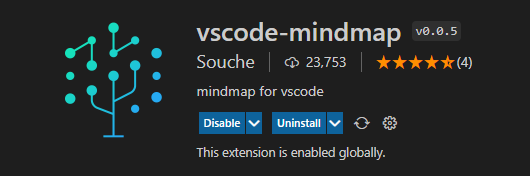

> 收集和整理一些公共的测试用例设计的业务建模，这样提高测试用例设计的效率，减少测试用例开发的时间。

# 测试用例库

## 介绍

通过收集和整理一些公共业务逻辑，整理一些功能点的测试用例，本着选取的粒度小，覆盖的功能点测试场景全的方向进行开发，建立测试用例的场景梳理的思维导图，这样在后续的测试用例设计的时候，可以通过简单的筛选就可以在项目中实际使用，从而提高质量效能。

## 工具

开发使用了VSCode，安装了vscode-mindmap插件，进行思维导图的开发，如果要使用你也可以采用我开发这个库的方式VSCode和vscode-mindmap插件，也可以使用百度脑图。

